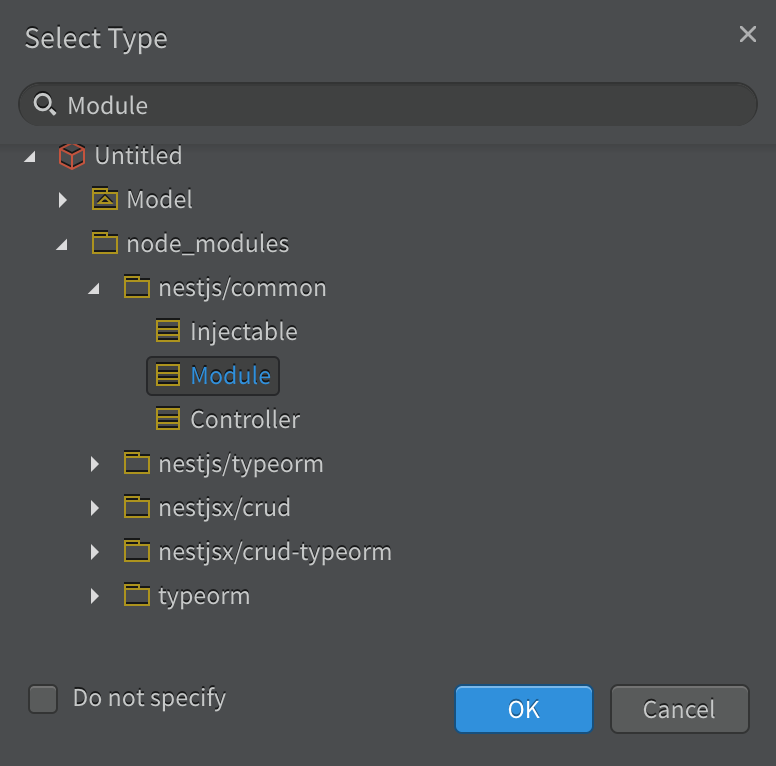
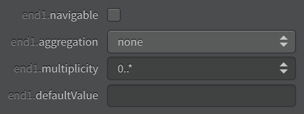

# StarUML NestJS CRUD Generator
The generator is target to generate controllers and services for [nestjsx/crud](https://github.com/nestjsx/crud) and [nestjs/swagger](https://github.com/nestjs/swagger) based on [typeorm](https://github.com/typeorm/typeorm) entities. You will only need to draw typeorm entities and their relationships, the rest will be handled by the tool automatically. Features:

- Support embedded entities (classes with stereotype `fields`).
- Support all kinds of entity relationships (even trees).
- Support cross module references.
- Generate ready to use CRUD APIs and Swagger Docs.

The followings are entities borrowed from Salesforce CRM platform. As you can see, there are many-to-many, many-to-one and one-to-many relationships etc. The `AddressFields`, `SystemFields` classes are embedded entities with stereotype `fields`. We will dive into details later on.


<!-- toc -->

## Overview

In order to support the above features, there are a few rules need to be followed. Some are self invented terms such as `fields` stereotype for embedded entities. Although it sounds complex, it is easy to use with the following main steps in mind:

1. Create an empty StarUML project
2. Add node_modules package automatically
3. Draw entity relationship class diagram manually
4. Add crud services and controllers automatically
5. Generate nestjs code automatically

As you can see only the 3rd step requires manual configuration. The library currently only runs positive test cases, and complex class/interface inheritances have not been tested. However for just entity relationship diagrams, the current implementaion is sufficient. 

## Installation

If the "Install From URL.." option does not work for you, by putting the github project url into the text field. Please directly download the soruce code and put the `staruml-nestjs` folder under the following directory accordingly.

- MAC OS: `/Users/<user>/Library/Application Support/StarUML/extensions/user`
- Windows: `C:\Users\<user>\AppData\Roaming\StarUML\extensions\user`
- Linux: `~/.config/StarUML/extensions/user`

## Quick Start

For a quick start, please just download the sample [Salesforce.mdj](./doc/sample/Salesforce.mdj) file directly. To generate your first NestJS module, please follow these steps:

1. Double click to open Salesforce.mdj.
2. Click Menu Item: **Tools** => **NestJS** => **Generate Code...**
3. Select any module (the package with `<<Module>>` stereotype), such as app or sales.
4. Press OK and select a directory to output the generated source codes.

## 1. Create a StarUML Project

1. Create an empty StarUML project.
  
  - The red cube represents a StarUML project, similarly to NodeJS/NestJS project root folder where package.json file resides.
  - The Model (folder icon with a triangle in it) is equivalent to an `src` folder in NodeJS/NestJS world.
  - The green icon named `Main` is the class diagram.

## 2. Add node_modules Meta Classes

1. Click menu item: **Tools** => **NestJS** => **Add Meta Class...**
2. Select the red cube StarUML project, and press OK.
3. The `node_modules` package will be generated under the project. These are mainly used as stereotypes during entity and relationship creation.
  

##3. Draw Class Diagram

### 3.1 Create Module/Folder

Module is just a StarUML package with stereotype `Module`. StarUML package is the fundamental element to organize classes. Each package with/without stereotype will be treated as a folder. And the package name will be directed used as the folder name. So we don't follow `com.nestjs.package` java naming convention for the package names. During the generation, a `name-of-something.module.ts` file with proper import and declaration will be created for you. Please follow the following steps to create a module:

1. Right click on Model.
2. Click Add => Package.
3. Rename Package to `app` or any appropriate module name.
4. Assign `<<Module>>` stereotype by clicking the magnifying glass icon besides the stereotype field.
  
5. Type `Module` to search for the class `Module` under `nestjs/common` package. Select it and press OK button.

6. And make sure there is a yellow class icon besides the stereotype selected. If you type the `Module` string directly into the stereotype text field, the class icon won't appear.


### 3.2 Create Entities

Entities are just plain UML classes with stereotype `Entity`. The generated entity file name will look like `name-of-something.entity.ts`. **Note**: there will be corresponding model classes generated for every entity classes implicitly. The model class name will be the entity class name suffixed with `Model`. The generated model file name will look like `name-of-something.model.ts`.

1. In order to add new Entity classes later, let's create a new package `entities` under the module we created above. This is for better organize the generated entity class files.

2. Right click the `entities` package created above.
3. Click Add => Class.

4. Use `Entity` class as its stereotype. Please use the magnifying glass to search the class as we did for modules. And make sure the yellow class icon is present besides the stereotype selected.

5. Drag and drop the newly created class onto the diagram, so we can visually add columns later.

### 3.3 Create Embed Entities (FieldSet)

embedded entities are just plain UML classes with stereotype `FieldSet`. The class name should be suffixed with `FieldSet` as well. The generated class names will look like `name-of-something.fieldset.ts`.

1. Right click the `entities` package created above.
2. Click Add => Class, and rename it with `FieldSet` suffix.

3. Just type `FieldSet` in the stereotype text field. **Caution**: there is no corresponding meta class for FieldSet.

4. Drag and drop the newly created class onto the diagram, so we can visually add columns later.

### 3.4 Create Columns

#### Data Types

All valid typeorm data types or FieldSet class types can be used as column data types, such as `string`, `number`, `boolean`, or `Date` etc. When referencing `FieldSet` as data types, the correct class type can be automatically resolved after typing. As you can see the yellow class icon is present besides the type property. Please double check this if any data type reference is not imported for the entity after code generation. The `FieldSet` class can resides in `<<Module>>` package other than the current entity module, such as a shared module.


#### Optional Columns

Please add the `?` mark after the name for optional columns. In the following example, industry is an optional column.


#### Primary Columns

Check the `isID` checkbox for typeorm `PrimanyColumn`. And also check the `isDerived` checkbox if it is a typeorm `PrimanyGeneratedColumn`.


### 3.5 Establish Relationships

**Note**: All relationships are UML associations, and must be drawn in the direction from Child to Parent.

#### One-to-One

```
|---------|                 |---------| 
| Parent  |                 |  Child  |
|---------|-----------------|---------|
|---------|                 |---------|
```

1. Just draw a plain association from child to parent class.

#### One-to-Many/Many-to-One

```
|---------|                 |---------| 
| Parent  |             0..*|  Child  |
|---------|-----------------|---------|
|---------|                 |---------|
```

1. Just draw a plain association from child to parent class.
2. And change the multiplicity at child end to a range above 1. For simplicity, let's just use `0..*`.

#### Many-to-Many
```
|---------|                 |---------| 
| Parent  |0..*         0..*|  Child  |
|---------|-----------------|---------|
|---------|                 |---------|
```

1. Just draw a plain association from child to parent class.
2. Change the multiplicity at both child and parent end to a range above 1. For simplicity, let's just use `0..*`.

#### Unidirectional Reference

```
|---------|                 |---------| 
| Parent  |             0..*|  Child  |
|---------|<----------------|---------|
|---------|                 |---------|
```

If you don't want the Parent class have an array field referencing its children, but Child class have a field referencing its parent instance, or vice versa. Please disable the navigable at the Child end. Since we always draw from Child to Parent, it is the end1.navigable checkbox that needs to be unchecked. By doing this, the association at parent end will turn into an arrow.


#### Self Reference

Self referencing is allowed, and must be one-to-many/many-to-one relationship. If typeorm tree structure is needed for the self referencing hierarchy relationship. Please assign the stereotype of the association to the `Tree` class under `typeorm` package.


By default `materialized-path` strategy will be used to establish the tree structure. If other strategies are used, please specify it as the association name. For a complete tree establish strategy, please refer to typeorm [Tree Entities](https://typeorm.io/#/tree-entities) document.

## 4. Add CRUD Service and Controller Classes

1. Click menu item: **Tools** => **NestJS** => **Add Crud Class...**
2. Select top or sub `<<module>>` package containing entities.
3. Press OK, the services and controllers will be generated under their corresponding folders.

4. The services and controllers package in above screenshot are automatically created to organize the newly added classes. However, entities are not required to be under the entities folder, they can be anywhere within the `<Module>` package.

## 5. Generate NestJS Code

1. Click Menu Item: **Tools** => **NestJS** => **Generate Code...**
2. Select any module (the package with `<<Module>>` stereotype).
3. Press OK and select a directory to output the generated soruce codes.

## Finally

In order to run the generated code, we have to put them into a NestJS project with additional npm packages installed. Please refer to official docs on how to [nestjsx/crud](https://github.com/nestjsx/crud) and [nestjs/swagger](https://github.com/nestjs/swagger).

```yaml
"@nestjs/swagger": "^3.1.0",
"@nestjsx/crud": "^4.2.0",
"@nestjsx/crud-typeorm": "^4.2.0",
"class-transformer": "^0.2.3",
"class-validator": "^0.10.2",
"swagger-ui-express": "^4.1.2",
```

Please don't forget to import the generated modules. And the `main.ts` should look like the followings:

```typescript
import { CrudConfigService } from '@nestjsx/crud';
import { NestFactory } from '@nestjs/core';
import { SwaggerModule, DocumentBuilder } from '@nestjs/swagger';
import { AppModule } from './app.module';

async function bootstrap() {
  const app = await NestFactory.create(
    AppModule.forRoot(),
  );

  const options = new DocumentBuilder()
    .setTitle('API Document')
    .setVersion('1.0')
    .build();
  const document = SwaggerModule.createDocument(app, options);
  SwaggerModule.setup('docs', app, document);

  await app.listen(process.env.PORT || 3000);
}
bootstrap();
```

## License
[MIT]
